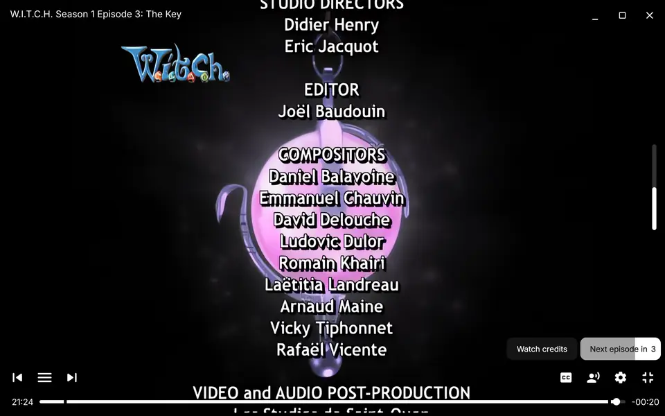
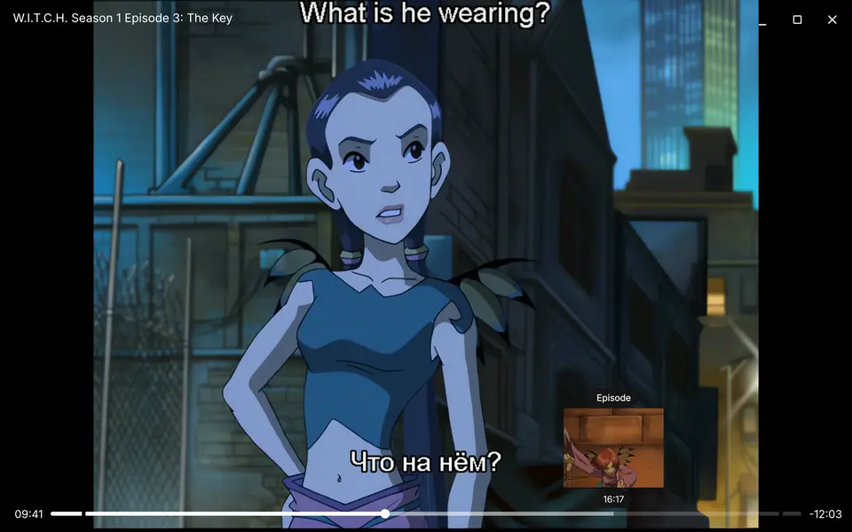
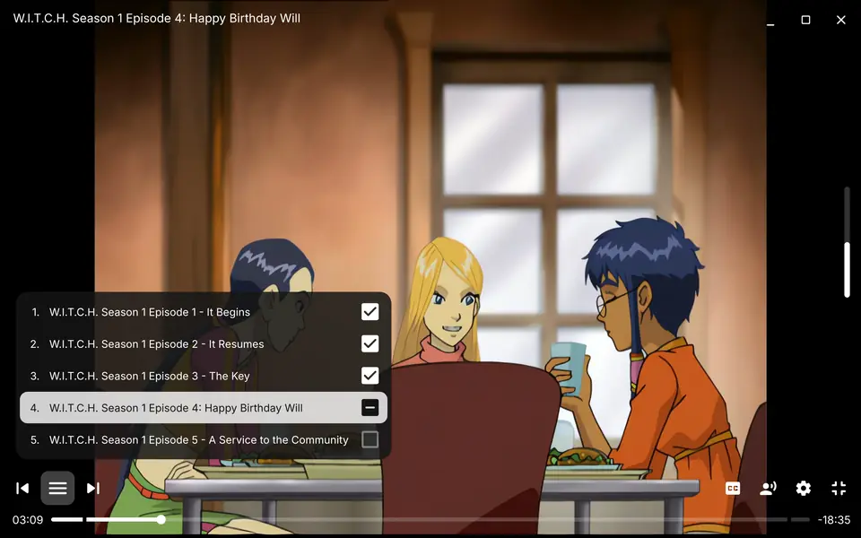

<h1 align="center">DinaPlayer</h1>

VIDEO PLAYER FOR WINDOWS

<b>All the comfort of streaming. Free, no ads.</b>

  <a href="https://github.com/sha-ridi/my-video-player/releases/latest/download/DinaPlayer-Setup.exe"><b>⬇&nbsp; Download for Windows</b></a>

---

|  |  |  |
|:--:|:--:|:--:|
| Skips openings and endings | Familiar, intuitive interface | Marks which episodes you've watched |

---

Free software under the GPL — see [THIRD-PARTY.md](THIRD-PARTY.md) and [LICENSE](LICENSE).
